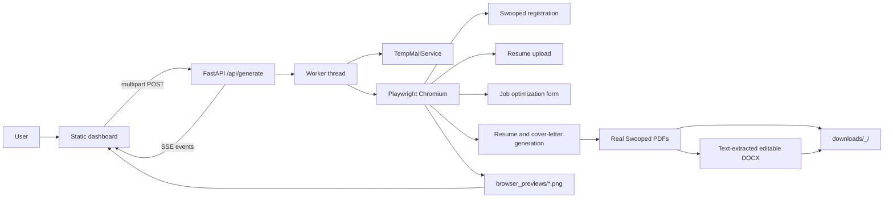

# ResumeFlow Mark 2 (RFM2)

> **Real-browser resume tailoring and document export**

[](https://fastapi.tiangolo.com/)
[](https://playwright.dev/)
[](https://www.python.org/)
[](#output-layout)
[](#project-status)

**ResumeFlow Mark 2** is a FastAPI application that operates the rendered
[Swooped](https://swooped.co/) website through a real Playwright Chromium
browser. It does not call Swooped's private API.

A run provisions a disposable mailbox, registers a temporary Swooped account,
uploads a base resume, submits the target company, role, and job description,
waits for Swooped to generate the optimized resume and cover letter, captures
the actual Swooped PDF downloads, and exports editable DOCX copies.

The dashboard includes compact screenshots from the same browser session, so
users can see the operation progressing in real time rather than relying only
on server log text.

> **Important:** Swooped is a third-party website. Its UI, account rules,
> anti-automation controls, generated document format, and download controls
> can change without notice. Treat this project as an automation integration,
> not as a guarantee that a third-party service will remain compatible.

## Project status

This is an active browser-automation integration. The default path is the
fast local Playwright pipeline. Optional Browser Use Cloud session support is
retained for interactive remote-browser experiments but is not required for
the main workflow.

## Capabilities

- Real Chromium automation through Playwright.
- Temporary mailbox provisioning through Mail.tm, with a 1secmail fallback.
- Registration retry and authentication-state validation.
- Resume upload through Swooped's first-run and resume routes.
- Resilient field discovery for company, role, and job-description controls.
- Swooped asynchronous generation handling, including resume-choice modals and
  completion states.
- Capture of Swooped's actual PDF downloads. The application does not fabricate
  replacement PDFs.
- DOCX exports created from text extracted from the downloaded Swooped PDFs.
  The PDF is authoritative; DOCX is an editable text representation and may
  not preserve the original PDF layout.
- SSE progress streaming from the worker thread to the browser dashboard.
- Browser screenshots at registration, upload, generation, and completion.
- Local download endpoints for PDF and DOCX files.
- Optional account deletion through the rendered Swooped settings UI.
- Optional Browser Use Cloud session endpoints retained separately from the
  default local Playwright pipeline.

## End-to-end architecture



### Runtime boundaries

1. The browser UI sends `resume_file`, `company_name`, `job_title`, and
   `job_description` to `/api/generate`.
2. FastAPI starts `BrowserSwoopedEngine.execute_pipeline` in an executor so
   the event loop remains responsive.
3. Progress callbacks are placed on an asyncio queue and emitted as SSE
   `data: {...}` events.
4. The Playwright context is fresh for every run. It uses
   `accept_downloads=True` and no persistent user profile.
5. Swooped-generated PDFs are saved first. DOCX files are generated only after
   both PDFs exist and contain extractable text.
6. Browser screenshots are saved outside the repository's tracked source and
   are served through `/api/browser-preview/{filename}`.

## Requirements

- Python 3.10 or newer.
- Git.
- Chromium installed by Playwright.
- Network access to Swooped and the selected temporary-mail provider.
- A machine/container that can run a Chromium browser.

The current development environment uses Python 3.14, but the code targets
Python 3.10+.

## Installation

```bash
git clone https://github.com/NallukumarRavichandran/resumeFlowMark2.RFM2.git
cd resumeFlowMark2.RFM2

python3 -m venv .venv
source .venv/bin/activate

python -m pip install --upgrade pip
python -m pip install -r requirements.txt
python -m playwright install chromium
```

On Windows PowerShell:

```powershell
py -m venv .venv
.\.venv\Scripts\Activate.ps1
python -m pip install -r requirements.txt
python -m playwright install chromium
```

## Configuration

### Local browser mode

The default pipeline runs headless:

```bash
export BROWSER_HEADLESS=true
```

To watch the actual Chromium window on a machine with a graphical display:

```bash
export BROWSER_HEADLESS=false
```

In a headless Codespace, use the dashboard screenshots instead. Setting
`BROWSER_HEADLESS=false` without a display server will fail.

### Optional Browser Use Cloud

The repository retains an optional Browser Use Cloud implementation in
`browser_session.py` and `remote_browser_engine.py`. It is not used by the
default fast `/api/generate` route. Configure it only when using the optional
`/api/browser/start` and `/api/browser/message` routes:

```bash
export BROWSER_USE_API_KEY="your-key"
```

Never commit this key. Live browser URLs and temporary account credentials
should be treated as sensitive.

## Running the server

```bash
source .venv/bin/activate
python app.py
```

The server binds to `0.0.0.0:8000`, which is required for Docker/Codespaces
port forwarding. Open:

```text
http://127.0.0.1:8000
```

For a Codespace, open the forwarded port 8000 URL from the Ports panel.

### Direct Uvicorn command

```bash
uvicorn app:app --host 0.0.0.0 --port 8000 --reload
```

Do not start two servers on the same port. If the browser shows a 502 from a
forwarded URL, first check that the process is listening on port 8000 and that
it is bound to `0.0.0.0`, not only `127.0.0.1`.

## Dashboard workflow

1. Select a `.pdf`, `.docx`, or `.txt` base resume.
2. Enter the target company.
3. Enter the target role.
4. Paste the complete job description.
5. Click **Run full Swooped operation**.
6. Watch the compact browser preview:
   - account registered;
   - resume uploaded;
   - optimization/generation in progress;
   - documents ready.
7. Download:
   - Swooped Resume PDF;
   - Resume DOCX;
   - Swooped Cover Letter PDF;
   - Cover Letter DOCX.

For `.txt` input, the engine temporarily converts it to a DOCX upload because
Swooped validates resume extensions. The temporary upload file is deleted
after the browser upload attempt.

## Output layout

Each run uses a sanitized folder name:

```text
downloads/
└── <Company>_<Role>/
    ├── <Company>_<Role>_Tailored_Resume.pdf
    ├── <Company>_<Role>_Tailored_Resume.docx
    ├── <Company>_<Role>_Cover_Letter.pdf
    └── <Company>_<Role>_Cover_Letter.docx
```

The PDF files are downloaded from Swooped. The DOCX files are generated by
extracting PDF text with `pypdf` and writing paragraphs with `python-docx`.
This means DOCX layout, fonts, graphics, columns, and exact spacing can differ
from the source PDF.

## API reference

### `GET /`

Returns the static dashboard HTML.

### `POST /api/generate`

Multipart form fields:

| Field | Required | Description |
|---|---:|---|
| `resume_file` | yes | PDF, DOCX, or TXT resume |
| `company_name` | yes | Target company |
| `job_title` | yes | Target role |
| `job_description` | yes | Full job description |

The response is `text/event-stream`. Each event is JSON after the `data: `
prefix:

```json
{
  "step": 3,
  "total": 6,
  "message": "Resume uploaded in Swooped",
  "data": {
    "preview_url": "/api/browser-preview/abc123_uploaded.png"
  }
}
```

Completion event:

```json
{
  "step": 6,
  "total": 6,
  "done": true,
  "message": "Completed! Documents generated & credentials ready.",
  "result": {
    "run_id": "abc123",
    "folder_name": "Example_Engineer",
    "folder_path": ".../downloads/Example_Engineer",
    "account_deleted": false
  }
}
```

Errors are emitted as:

```json
{
  "error": true,
  "message": "Human-readable failure reason"
}
```

### `GET /api/download/{folder_name}/{filename}`

Serves a generated PDF or DOCX file. The route checks that the requested file
exists under the downloads directory and returns 404 otherwise.

### `GET /api/browser-preview/{filename}`

Serves a generated PNG browser screenshot with `Cache-Control: no-store`.
Filenames are reduced to their basename before joining with the preview
directory.

### `GET /api/logs`

Returns account lifecycle records stored by `AccountLogger`. These records can
contain temporary credentials; protect this endpoint in any public deployment.

### `POST /api/delete-account`

Form field:

```text
account_id=<run_id>
```

The engine logs into Swooped through Playwright and attempts the rendered
settings-page deletion flow.

### Optional interactive Browser Use routes

- `POST /api/browser/start`: starts an optional remote session.
- `POST /api/browser/message`: sends a follow-up command to that session.

These routes are separate from the local fast pipeline.

## SSE progress stages

| Stage | Meaning |
|---:|---|
| 1 | Provision a disposable mailbox |
| 2 | Register and authenticate Swooped account |
| 3 | Upload and persist the base resume |
| 4 | Submit company, role, job description, and cover-letter option |
| 5 | Wait for Swooped asynchronous generation and capture preview |
| 6 | Save actual Swooped PDFs and create DOCX exports |

The callback may emit additional messages at the same stage when a browser
preview is captured.

## Testing and verification

### Static checks

```bash
python -m py_compile app.py browser_engine.py swooped_engine.py \
  tempmail_service.py test_pipeline.py
git diff --check
```

### Live end-to-end smoke test

This creates a real disposable mailbox and a real Swooped account:

```bash
BROWSER_HEADLESS=true python test_pipeline.py
```

The smoke test verifies:

- account provisioning;
- Swooped registration;
- resume upload;
- optimization submission;
- Swooped PDF downloads;
- DOCX exports;
- expected output filenames.

The test requires network access and may consume third-party service quota.
Do not run it against production credentials or a personal mailbox.

### Validate outputs

```bash
python - <<'PY'
from pathlib import Path
from docx import Document
from pypdf import PdfReader

root = Path("downloads")
for path in sorted(root.glob("**/*")):
    if path.suffix == ".pdf":
        reader = PdfReader(str(path))
        print(path, "pages=", len(reader.pages),
              "producer=", reader.metadata.get("/Producer"))
    elif path.suffix == ".docx":
        document = Document(str(path))
        print(path, "paragraphs=", len(document.paragraphs))
PY
```

Real Swooped PDFs should not report the old `ReportLab PDF Library` producer.
DOCX files should contain at least one paragraph of extracted text.

## Troubleshooting

### Forwarded URL returns HTTP 502

Check the server process and port:

```bash
curl -i http://127.0.0.1:8000/
ss -ltnp | grep 8000
```

Start with `--host 0.0.0.0`. A server bound only to localhost is not reachable
through a Codespaces forwarded domain.

### Registration remains on `/auth/register`

The engine retries registration up to three times, performs native form
submission as a fallback, and validates the resulting `/app` route. Inspect
the emitted error message for the rendered form state. Swooped may reject a
mail provider, rate-limit the browser, require verification, or change its
registration UI.

### Resume upload succeeds but no resume appears

The engine tries both the first-run `/app` route and `/app/resumes`, waits for
processing, advances visible setup controls, and verifies that the resume
persists. A third-party processing delay or account restriction can still
prevent persistence.

### No Swooped download is found

The engine intentionally fails instead of fabricating output. Inspect the
browser preview and the visible-controls diagnostic. Swooped may still be
processing, may require selecting a focused/comprehensive resume, or may have
changed its download UI.

### DOCX is visually different from PDF

This is expected. DOCX is an editable text export from the authoritative
Swooped PDF; it is not a layout-preserving PDF-to-Word renderer.

### Browser preview is not visible

Confirm that:

- the run has started;
- the SSE connection is open;
- `/api/browser-preview/<filename>` returns `image/png`;
- the browser is not displaying a stale cached JavaScript bundle.

The dashboard uses versioned CSS/JS query strings and adds a timestamp to
preview URLs.

## Security and privacy

- Never commit `BROWSER_USE_API_KEY`.
- Do not publish `/api/logs` without authentication; it can contain temporary
  email addresses and passwords.
- Treat preview URLs, temporary credentials, and Swooped session URLs as
  sensitive.
- Do not use this application to bypass account protections, rate limits, or
  access controls.
- Use disposable accounts only where permitted by the third-party service's
  terms.
- Runtime directories `downloads/` and `browser_previews/` are ignored by Git.
- Clear generated accounts and local files when a run is no longer needed.

## Repository structure

```text
.
├── app.py                  # FastAPI app, SSE route, downloads, previews
├── browser_engine.py       # Local Playwright Swooped workflow
├── browser_session.py      # Optional Browser Use Cloud sessions
├── remote_browser_engine.py# Optional remote execution engine
├── swooped_engine.py       # Compatibility export for BrowserSwoopedEngine
├── tempmail_service.py     # Mail.tm/1secmail provisioning
├── account_logger.py       # Local account lifecycle audit records
├── doc_converter.py        # Legacy document helpers retained for compatibility
├── static/
│   ├── index.html          # Dashboard markup
│   ├── app.js              # Form submission, SSE, previews, downloads
│   └── styles.css          # Dashboard and browser-preview styles
├── test_pipeline.py        # Live end-to-end smoke test
├── downloads/              # Ignored generated files
└── browser_previews/       # Ignored generated screenshots
```

## Operational notes

- A run opens a new browser/context and closes it in a `finally` block.
- The default pipeline is synchronous inside a worker thread but streamed to
  the browser through SSE.
- Generated accounts remain active until explicitly deleted.
- Failed runs can leave an account at Swooped; use the recorded run ID with
  the account deletion endpoint after investigating the failure.
- Swooped UI selectors are deliberately label- and metadata-based because
  route-specific internal selectors are unstable.

## License and third-party services

This repository automates a third-party website and depends on third-party
packages listed in `requirements.txt`. Review the terms, usage limits, and
privacy policies of Swooped, Mail.tm, 1secmail, Playwright, and Browser Use
before deploying or redistributing the application.
