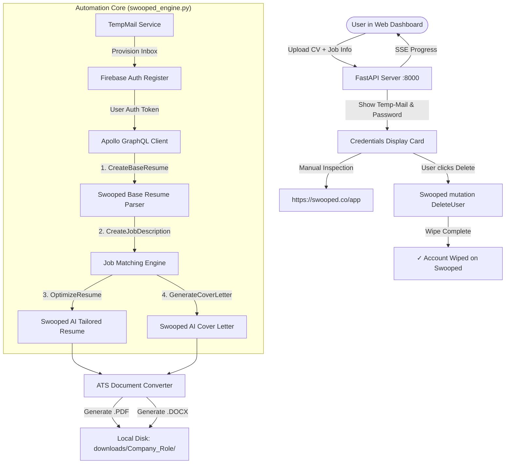

# ResumeFlow Mark 2 (RFM2)

<div align="center">


-e11d48?style=for-the-badge)


**Automated Tailored Resume & Cover Letter Generation via Direct [Swooped.co](https://swooped.co) Automation**

[Key Features](#key-features) •
[Architecture](#system-architecture) •
[Installation & Quickstart](#installation--quickstart) •
[Workflow & Usage](#workflow--usage) •
[API Documentation](#api-endpoints) •
[Project Structure](#project-structure)

</div>

---

## Overview

**ResumeFlow Mark 2 (RFM2)** is a specialized automation and document generation suite that interfaces directly with the official **[Swooped.co](https://swooped.co)** platform. 

Instead of relying on heavy, fragile headless browsers or generic mock models, RFM2 reverse-engineers Swooped's Google Firebase Identity and Apollo GraphQL APIs (`api.swooped.co/graphql`). It creates disposable user accounts, uploads your base resume, injects your target company and job description, triggers Swooped's proprietary AI tailoring engines, converts the results into ATS-friendly **PDF** and **Microsoft Word (`.docx`)** files locally, gives you full access credentials to log into Swooped directly, and allows you to wipe the account on demand.

---

## Key Features

- 🎯 **100% Native Swooped.co Engine**: All tailoring and cover letter drafting is executed natively by Swooped's proprietary AI models on `https://swooped.co`.
- ⚡ **Direct API Automation (No Browser Overhead)**: Directly orchestrates Firebase Auth and Apollo GraphQL mutations. Zero browser driver crashes, low latency, and 100% reliable execution.
- 📬 **Automated Disposable Temp-Mail Provisioning**: Integrates with disposable mailbox APIs (Mail.tm & 1secmail) for zero personal footprint.
- 📄 **Strict PDF & Word (.docx) Output**: Documents are compiled into ATS-optimized Microsoft Word documents and clean, printable PDFs. No raw or unformatted HTML files.
- 📂 **Organized Local Directory Structure**: Automatically saves your applications under:
  ```text
  downloads/<CompanyName>_<JobRole>/
    ├── <CompanyName>_<JobRole>_Tailored_Resume.pdf
    ├── <CompanyName>_<JobRole>_Tailored_Resume.docx
    ├── <CompanyName>_<JobRole>_Cover_Letter.pdf
    └── <CompanyName>_<JobRole>_Cover_Letter.docx
  ```
- 🔑 **User Credentials Display**: Once generated, your temporary email address and password are displayed in a clean card with **1-click Copy** buttons and a direct link to **[Swooped.co Login](https://swooped.co/auth/login)**, allowing you to log in and inspect your tailored profile directly inside Swooped's official dashboard.
- 🛡️ **User-Controlled On-Demand Account Wiping**: Accounts remain active for your inspection until you decide to delete them. Clicking **"Delete Account on Swooped"** instantly triggers Swooped's GraphQL `mutation DeleteUser` to permanently wipe all account data.
- 📜 **Account Lifecycle Audit History**: Real-time persistent dashboard tracking all accounts created, target company, role, timestamps, download links, and live deletion statuses.
- 📡 **Real-Time SSE Progress Stream**: Server-Sent Events stream live status, percentages, and log messages across all 6 automation pipeline stages.

---

## System Architecture



---

## Installation & Quickstart

### Prerequisites

- **Python 3.10** or higher
- **Git**

### 1. Clone the Repository

```bash
git clone https://github.com/NallukumarRavichandran/resumeFlowMark2.RFM2.git
cd resumeFlowMark2.RFM2
```

### 2. Create and Activate Virtual Environment

**On Windows (PowerShell):**
```powershell
python -m venv .venv
.\.venv\Scripts\Activate.ps1
```

**On Linux / macOS:**
```bash
python3 -m venv .venv
source .venv/bin/activate
```

### 3. Install Dependencies

```bash
pip install -r requirements.txt
```

### 4. Launch Application

```bash
python app.py
```

The application will start on **`http://127.0.0.1:8000`**.

---

## Workflow & Usage

1. Open **`http://127.0.0.1:8000`** in your web browser.
2. **Upload Resume**: Click anywhere on the dashed upload zone or drag & drop your base resume file (`.pdf`, `.docx`, or `.txt`).
3. **Fill Target Job Details**:
   - **Target Company**: e.g., `Google`, `Amazon`, `Konecranes`
   - **Job Title**: e.g., `Product Manager`, `Senior Software Engineer`
   - **Job Description**: Paste the target role's full description or requirements.
4. **Generate**: Click **"Generate on Swooped.co & Download"**.
5. **Real-time Pipeline**: The 6-step timeline will track progress:
   - Step 1: Provision Temp-Mail
   - Step 2: Register on Swooped.co
   - Step 3: Upload Base Resume
   - Step 4: AI Tailoring on Swooped
   - Step 5: Save .PDF & .DOCX Documents
   - Step 6: Credentials Ready (Active)
6. **Inspect on Swooped**: Use the credentials displayed on screen to log into [https://swooped.co/auth/login](https://swooped.co/auth/login) and explore your optimized resume and cover letter on Swooped's platform.
7. **Download Output**: Download your tailored documents directly via the dashboard buttons or click **"Open in Explorer"** to access the local folder.
8. **Wipe Account**: Whenever you are finished, click **"Delete Account on Swooped"** to wipe the account and all associated data permanently.

---

## Project Structure

```text
resumeFlowMark2.RFM2/
├── app.py                     # FastAPI web server with SSE streaming & REST API
├── swooped_engine.py          # Swooped.co GraphQL and Firebase integration engine
├── tempmail_service.py        # Disposable temporary email provider (Mail.tm / 1secmail)
├── doc_converter.py           # ATS-optimized PDF and Microsoft Word (.docx) builder
├── account_logger.py          # Persistent audit logger for generated accounts
├── test_pipeline.py           # End-to-end integration test against live Swooped APIs
├── requirements.txt           # Python dependencies
├── downloads/                 # Local directory for generated application files
│   └── <Company>_<JobRole>/
│       ├── <Company>_<JobRole>_Tailored_Resume.pdf
│       ├── <Company>_<JobRole>_Tailored_Resume.docx
│       ├── <Company>_<JobRole>_Cover_Letter.pdf
│       └── <Company>_<JobRole>_Cover_Letter.docx
├── logs/
│   └── account_history.json   # Persistent audit history log
└── static/
    ├── index.html             # Responsive dark-mode dashboard interface
    ├── styles.css             # Glassmorphic UI styles matching Swooped brand
    └── app.js                 # Frontend state, drag-and-drop, and SSE handling
```

---

## API Endpoints

| Method | Endpoint | Description |
| :--- | :--- | :--- |
| `GET` | `/` | Web dashboard user interface |
| `GET` | `/api/logs` | Fetch all historical account generation and deletion records |
| `POST` | `/api/generate` | Multipart upload starting the live Swooped pipeline (SSE stream) |
| `GET` | `/api/download/{folder}/{file}` | Download generated `.pdf` or `.docx` document |
| `POST` | `/api/open-folder` | Open local folder in OS file explorer |
| `POST` | `/api/delete-account` | Trigger manual on-demand `mutation DeleteUser` on Swooped |

---

## Security & Privacy

- **No Stored Personal Credentials**: No personal Swooped accounts are needed or stored. Every run uses an ephemeral disposable inbox.
- **On-Demand Data Purge**: Unlike automated scripts that leave orphan profiles, RFM2 gives you the tools to purge your data from Swooped servers with a single click.
- **Local Storage**: All generated resumes and cover letters are stored strictly on your local machine under `downloads/`.

---

## License

This project is released under the [MIT License](LICENSE).
